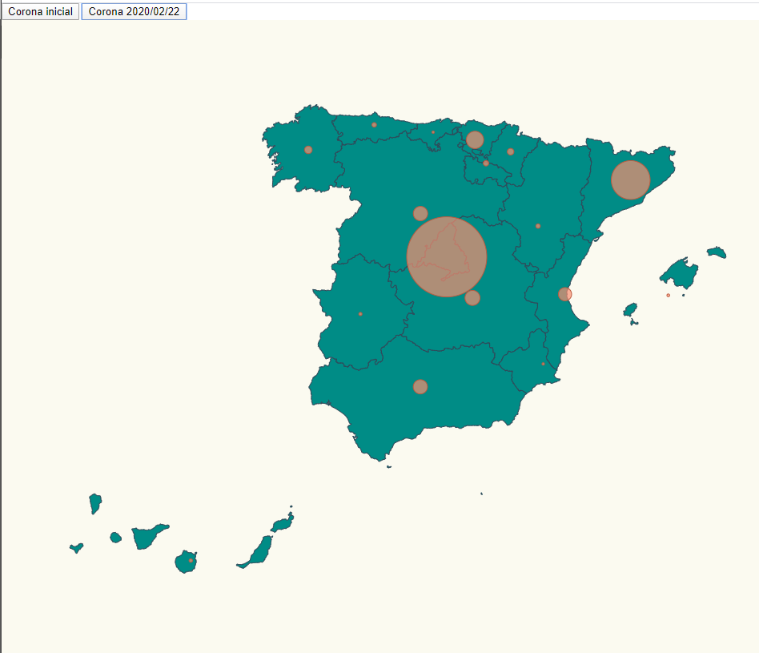

# Máster Advanced Analytics on Big Data (2019-2021)
# Universidad de Málaga

# Typescript Exercise

This was a mandatory exercise in my masters. It visualizes a map of spain and stats of COVID-19 afected in 2 separate dates.



I accomplished three tasks here:

- Placed pins on a map based on location.
- Scaled pins radius based on affected number.
- Spain got canary island that is a territory placed far away, I moved that islands and pasted them in a visible
  place in the map.

# Install

- Execute _npm install_. It will install everything in order to work.

```bash
npm install
```

# Start

- Start the script _npm start_. It will start the project and you can see the result in your browseron: http://localhost:1234/.

```bash
npm start
```

# Start

- My code is fully commented through the execution, almost line by line. For more detail you should look in specific libraryes.

